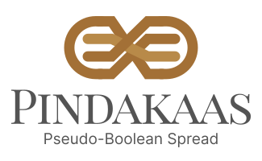

<p align="center">
  

  <p align="center">
    A library to transform pseudo-Boolean and integer constraints into conjunctive normal form.
    <br />
    <br />
    <a href="https://crates.io/crates/pindakaas"></a>
    <a href="https://crates.io/crates/pindakaas"></a>
  </p>
</p>


## Supported Constraints

- At most one (AMO)
  - Bitwise encoding
  - Ladder encoding
  - Pairwise encoding
- Cardinality constraints
  - Sorting Network encoding
- Boolean linear
  - Adder encoding
  - BDD encoding
  - Sequential Weight Counter encoding
  - Totalizer encoding
  - Modulo Totalizer encoding
- Integer (linear)
  - Direct / Domain / Unary encoding
  - Order encoding
  - Binary encoding

## Installation and usage

Although the main Pindakaas library is written in rust, it is also available from Python.

### Rust

```bash
cargo add pindakaas
```

For more information about the Rust library, please visit the [official documentation](https://docs.rs/pindakaas).

### Python

```bash
pip install pindakaas
```

For more information about the Python library, please visit the [official documentation](https://pindakaas.readthedocs.io/en/latest/).

## Citation

If you want to cite Pindakaas please use our general software citation, in addition to any citation to a specific version or paper:

```biblatex
@software{Pindakaas,
author = {Bierlee, Hendrik and Dekker, Jip J.},
license = {MPL-2.0},
title = {{Pindakaas}},
url = {https://doi.org/10.5281/zenodo.10851855},
doi = {10.5281/zenodo.10851855},
}
```

Note that you might have to use `misc` instead of `software`, if your system does not support `software` as a type.

## Acknowledgements

This research was partially funded by the Australian Government through the Australian Research Council Industrial Transformation Training Centre in Optimisation Technologies, Integrated Methodologies, and Applications ([OPTIMA](https://optima.org.au)), Project ID IC200100009

## License

This library is made available under the [MPL-2.0](https://choosealicense.com/licenses/mpl-2.0/) license.
