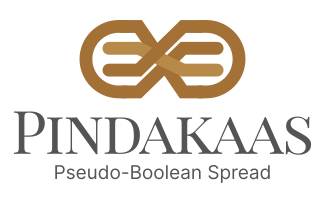

<p align="center">
  

  <p align="center">
    A library to transform pseudo-Boolean and integer constraints into conjunctive normal form.
    <br />
    <br />
    <a href="https://crates.io/crates/pindakaas"></a>
    <a href="https://crates.io/crates/pindakaas"></a>
  </p>
</p>


## Supported Constraints

- At most one (AMO)
  - Bitwise encoding
  - Ladder encoding
  - Pairwise encoding
- Cardinality constraints
  - Sorting Network encoding
- Boolean linear
  - Adder encoding
  - BDD encoding
  - Sequential Weight Counter encoding
  - Totalizer encoding
- Integer (linear)
  - Direct / Domain / Unary encoding
  - Order encoding
  - Binary encoding

## Installation and usage

Although the main pindakaas library is written in rust, it is also available from Python. (A C(++) interface is also under consideration).

### Rust

```bash
cargo add pindakaas
```

### Python

```bash
pip install pindakaas
```

## Acknowledgements

The encoding algorithms implemented in this library are based partially on the following academic research.

- **TODO**

This library is also heavily inspired by PBLib, an earlier library containing different encoding algorithms for pseudo-Boolean constraints. More information about PBLib can be found in its [accompanying publication](https://doi.org/10.1007/978-3-319-24318-4_2), and the source code for the library can be found on [GitHub](https://github.com/RealPete/PBLib)

This research was partially funded by the Australian Government through the Australian Research Council Industrial Transformation Training Centre in Optimisation Technologies, Integrated Methodologies, and Applications ([OPTIMA](https://optima.org.au)), Project ID IC200100009

## License

This library is made available under the [MPL-2.0](https://choosealicense.com/licenses/mpl-2.0/) license.
